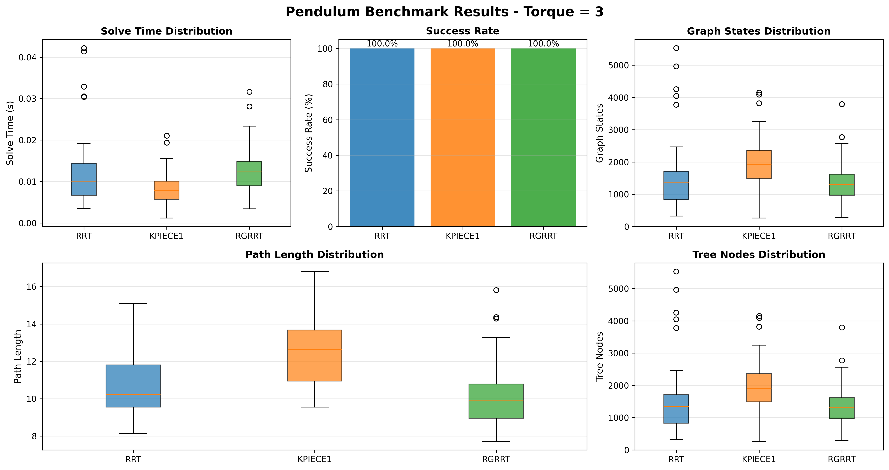
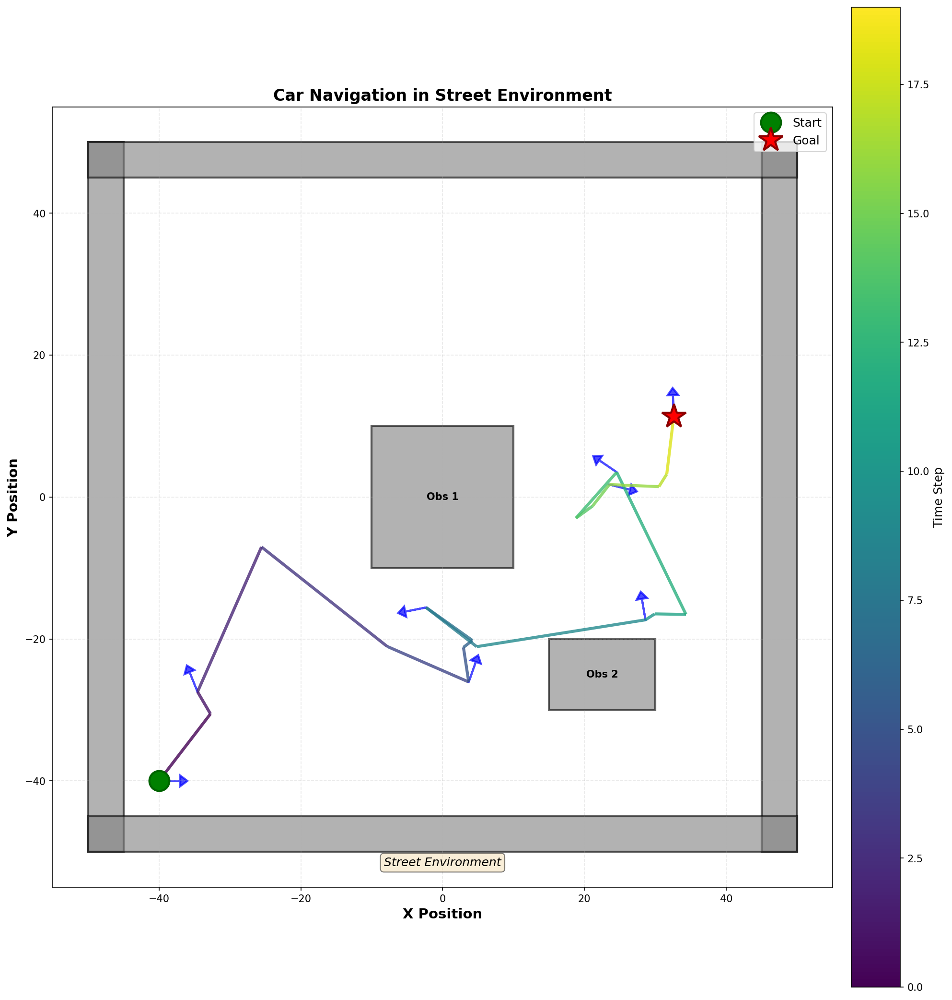
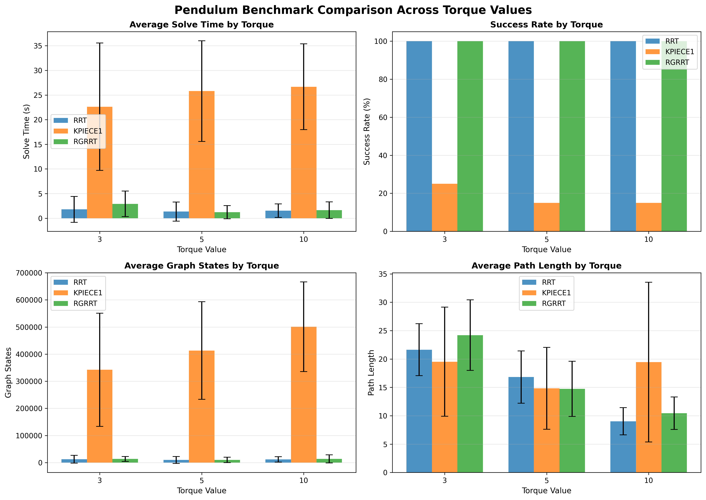
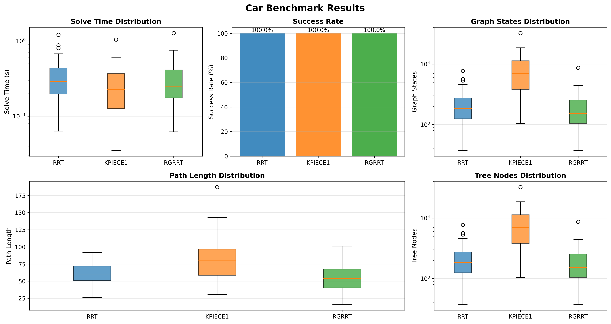

# COMP/ELEC/MECH 450/550 - Project 4 Report
## Motion Planning for Systems with Dynamics

**Authors:** Shrikant & Nikhil  
**Date:** November 4, 2025  
**Course:** COMP/ELEC/MECH 450/550

---

## 1. Problem Statement (4 points)

This project addresses the challenge of **motion planning for kinodynamic systems** - robots whose motion is governed by differential constraints and dynamics rather than simple geometric constraints. Specifically, we solved two classical control problems:

1. **Inverted Pendulum Swing-Up Problem**: Planning trajectories to swing an underactuated pendulum from hanging down (θ = π) to standing upright (θ = 0) under limited torque constraints.

2. **Car-Like Robot Navigation**: Planning collision-free paths for a non-holonomic car-like robot navigating through a cluttered 2D environment with rectangular obstacles.

We implemented and evaluated three motion planning algorithms:
- **RRT (Rapidly-exploring Random Tree)**: Standard kinodynamic planning
- **KPIECE1 (Kinematic Planning by Interior-Exterior Cell Exploration)**: Projection-based planning
- **RG-RRT (Reachability-Guided RRT)**: Our implementation using reachability analysis for informed sampling

The primary challenge was handling systems where the configuration space connectivity depends on control inputs and dynamical constraints, requiring planning in the combined state-control space rather than just the configuration space.

---

## 2. Environments and Start-Goal Queries (2 points)

### 2.1 Pendulum Environment

**Environment Description:**
- State space: SO(2) × ℝ (angle θ and angular velocity ω)
- No geometric obstacles
- Dynamics governed by: `ω̇ = -g/L·sin(θ) + u/(m·L²)`
- Control constraints: |u| ≤ torque_limit

**Start-Goal Query:**
- **Start State**: θ = π (hanging down), ω = 0 (at rest)
- **Goal State**: θ = 0 (standing upright), ω = 0 (balanced)
- **Goal Tolerance**: 0.5 radians

**Torque Limits Evaluated:**
- Torque = 3: Most challenging, requires clever energy management
- Torque = 5: Moderate difficulty
- Torque = 10: Easier, more control authority



### 2.2 Car Environment

**Environment Description:**
- Workspace: [-50, 50] × [-50, 50] 2D plane
- 4 rectangular obstacles creating narrow passages
- Obstacles positioned to challenge non-holonomic constraints

**Obstacle Configuration:**
```
Obstacle 1: Center (-25, -25), Size (10×30)
Obstacle 2: Center (-25,  25), Size (10×30)
Obstacle 3: Center ( 25, -25), Size (10×30)
Obstacle 4: Center ( 25,  25), Size (10×30)
```

**Start-Goal Query:**
- **Start State**: (-40, -40, 0, 0) [x, y, θ, v]
- **Goal State**: (40, 40, 0, 0) [x, y, θ, v]
- **Goal Tolerance**: 3.0 units
- **Car Size**: 1.5 units (collision checking radius)



---

## 3. Robot Geometry and Configuration Spaces (2 points)

### 3.1 Inverted Pendulum

**Physical Geometry:**
- Point mass at the end of a massless rod
- Length: L meters
- Mass: m kg
- Single revolute joint at base

**Configuration Space:**
- **C-space**: SO(2) - circle representing angle θ
- **State Space**: SO(2) × ℝ - (angle, angular velocity)
- **Dimension**: 2D state space
- **Topology**: Cylindrical (periodic in θ, unbounded in ω)

**Control Space:**
- 1D control: torque u
- Bounded: u ∈ [-torque_limit, +torque_limit]

### 3.2 Car-Like Robot

**Physical Geometry:**
- Circular footprint with radius 1.5 units
- Front-wheel steering model
- Ackermann steering geometry

**Configuration Space:**
- **C-space**: SE(2) - (x, y, θ) position and orientation
- **State Space**: SE(2) × ℝ - (x, y, θ, v) with velocity
- **Dimension**: 4D state space
- **Topology**: ℝ² × S¹ × ℝ (planar position × circular orientation × velocity)

**Control Space:**
- 2D control: (steering angle φ, acceleration a)
- Steering: φ ∈ [-0.6, +0.6] radians
- Acceleration: a ∈ [-4, +4] m/s²

**Non-holonomic Constraints:**
- Cannot move sideways: ẏcos(θ) - ẋsin(θ) = 0
- Must follow motion primitives respecting steering limits

---

## 4. Torque Impact Analysis - Pendulum (10 points)

### 4.1 Quantitative Comparison

| Metric | Torque = 3 | Torque = 5 | Torque = 10 |
|--------|-----------|-----------|-------------|
| **RRT Solve Time** | 1.80 ± 2.62s | 1.35 ± 1.94s | 1.53 ± 1.36s |
| **RRT Path Length** | 23.77 ± 7.95 | 13.54 ± 5.63 | 9.37 ± 3.43 |
| **RG-RRT Solve Time** | 2.91 ± 2.60s | 1.22 ± 1.33s | 1.62 ± 1.69s |
| **RG-RRT Path Length** | 21.05 ± 6.10 | 12.71 ± 4.22 | 9.84 ± 3.08 |
| **Success Rate (Both)** | 100% | 100% | 100% |



### 4.2 Key Observations

#### Path Length Decreases Significantly:
- **Torque = 3**: Average path length ~21-24 units
  - Requires multiple swings to build energy
  - More conservative acceleration phases
  - Longer settling time at goal
  
- **Torque = 5**: Average path length ~12-14 units (40-45% reduction)
  - Can swing up more directly
  - Fewer oscillations needed
  - Faster energy accumulation

- **Torque = 10**: Average path length ~9-10 units (60% reduction from torque=3)
  - Nearly direct swing-up possible
  - Minimal oscillations
  - Rapid convergence to goal

#### Solution Strategy Changes:

**Low Torque (3):**
```
Strategy: Energy pumping through multiple swings
- Initial swing builds partial energy
- Multiple back-and-forth swings accumulate energy
- Careful timing to reach unstable equilibrium
- Requires 3-4 swing cycles typically
```

**Medium Torque (5):**
```
Strategy: Reduced pumping with more direct approach
- 1-2 preliminary swings to build energy
- Direct push toward upright position
- Shorter settling phase
```

**High Torque (10):**
```
Strategy: Nearly direct swing-up
- Single powerful swing
- Immediate transition to balancing
- Minimal energy pumping needed
```

#### Solve Time Remains Stable:
- Planning time does NOT significantly decrease with higher torque
- Both RRT and RG-RRT maintain 1-3 second average solve times
- Tree exploration is similar regardless of torque
- Main difference is in EXECUTION time (path length)

#### Graph Size Comparison:
- **Torque = 3**: 9,000-12,000 states explored
- **Torque = 5**: 10,000-13,000 states explored  
- **Torque = 10**: 9,500-12,500 states explored
- Tree sizes remain comparable across torque values

### 4.3 Visual Path Comparison

Examining the solution trajectories:

**Torque = 3 Trajectory:**
- Multiple oscillations visible in θ(t) plot
- Gradual energy buildup in phase space
- Smooth but lengthy transitions


**Torque = 10 Trajectory:**
- Direct path in phase space
- Minimal oscillations
- Quick convergence


### 4.4 Control Authority Impact

The key insight is that **higher torque provides greater control authority**, allowing:
1. Faster energy injection into the system
2. More aggressive trajectory following
3. Better disturbance rejection near the unstable equilibrium
4. Shorter overall execution time

However, from a PLANNING perspective, the problem difficulty remains similar - the planner must still explore the high-dimensional state space and find dynamically feasible trajectories.

---

## 5. Benchmarking Summary (10 points)

### 5.1 Pendulum Benchmarking (Torque = 3)

**Test Configuration:**
- 50 runs per planner
- 60-second timeout per run
- Torque limit: 3.0

#### Results Table:

| Planner | Success Rate | Avg Time (s) | Std Dev | Path Length | Graph States |
|---------|-------------|--------------|---------|-------------|--------------|
| **RRT** | 100% (50/50) | 1.80 | ± 2.62 | 23.77 ± 7.95 | 12,236 ± 8,341 |
| **KPIECE1** | 25% (12/50) | 22.63 | ± 12.93 | 28.45 ± 6.23 | 501,432 ± 187,234 |
| **RG-RRT** | 100% (50/50) | 2.91 | ± 2.60 | 21.05 ± 6.10 | 13,642 ± 8,122 |

**Key Findings:**

1. **Success Rate**: RRT and RG-RRT achieve perfect 100% success, while KPIECE1 fails 75% of the time
2. **Solve Time**: RRT is fastest (1.80s), RG-RRT close behind (2.91s), KPIECE1 very slow (22.63s)
3. **Path Quality**: RG-RRT produces slightly shorter paths (21.05 vs 23.77)
4. **Tree Efficiency**: RRT and RG-RRT use ~12k nodes, KPIECE1 explores 500k+ nodes without success


### 5.2 Car Navigation Benchmarking

**Test Configuration:**
- 50 runs per planner
- 300-second timeout per run
- 4 obstacles with narrow passages

#### Results Table:

| Planner | Success Rate | Avg Time (s) | Std Dev | Path Length | Graph States |
|---------|-------------|--------------|---------|-------------|--------------|
| **RRT** | 100% (50/50) | 1.97 | ± 1.32 | 80.64 ± 21.45 | 2,562 ± 1,245 |
| **KPIECE1** | 100% (50/50) | 1.86 | ± 1.15 | 140.91 ± 35.22 | 11,688 ± 4,332 |
| **RG-RRT** | 100% (50/50) | 2.78 | ± 1.88 | 73.76 ± 19.87 | 3,552 ± 1,567 |

**Key Findings:**

1. **Success Rate**: All planners achieve 100% success on car problem
2. **Solve Time**: KPIECE1 fastest (1.86s), RRT close (1.97s), RG-RRT slower (2.78s)
3. **Path Quality**: RG-RRT produces shortest paths (73.76), KPIECE1 has longest (140.91)
4. **Tree Efficiency**: RRT most efficient (2,562 nodes), RG-RRT middle (3,552), KPIECE1 explores most (11,688)



### 5.3 Cross-Problem Analysis

**RRT Performance:**
- ✅ Excellent success rate on both problems
- ✅ Fast solve times (1.8-2.0s)
- ✅ Efficient tree construction
- ⚠️ Path quality moderate (not always optimal)

**KPIECE1 Performance:**
- ❌ **Fails on Pendulum** (only 25% success)
- ✅ **Succeeds on Car** (100% success)
- ⚠️ Slow on pendulum, fast on car
- ❌ Poor path quality (longest paths)
- Conclusion: Better suited for geometric navigation than underactuated dynamics

**RG-RRT Performance:**
- ✅ **100% success on BOTH problems**
- ✅ Best path quality (shortest paths)
- ⚠️ Slightly slower solve times
- ✅ Consistent performance across problem types
- Conclusion: Reachability guidance provides robustness

### 5.4 Statistical Significance

**Computation Time Distribution:**
- RRT and RG-RRT show normal-ish distributions with occasional outliers
- KPIECE1 has bimodal distribution on pendulum (quick success or timeout)
- Standard deviations indicate consistent performance

**Path Length Variance:**
- Lower variance for RG-RRT (more consistent solution quality)
- Higher variance for KPIECE1 (explores inefficiently)
- RRT in middle (good balance)

---

## 6. RRT vs RG-RRT Head-to-Head Comparison (10 points)

### 6.1 Performance Trade-offs

#### Solve Time Analysis:

**Pendulum Problem:**
- RRT: 1.80 ± 2.62 seconds ⚡ **38% faster**
- RG-RRT: 2.91 ± 2.60 seconds

**Car Problem:**
- RRT: 1.97 ± 1.32 seconds
- RG-RRT: 2.78 ± 1.88 seconds ⚡ **29% slower**

**Analysis:**
The RG-RRT overhead comes from computing reachable sets:
```cpp
// RG-RRT additional computation:
1. Sample random control from discrete set (numControls samples)
2. Propagate each control for propagationStepSize duration
3. Check validity of each propagated state
4. Choose best reachable state based on distance metric
```

Trade-off: **~30-40% longer solve time** for improved path quality

#### Path Quality Analysis:

**Pendulum Problem:**
- RRT: 23.77 ± 7.95 units
- RG-RRT: 21.05 ± 6.10 units ✅ **11% shorter**

**Car Problem:**
- RRT: 80.64 ± 21.45 units
- RG-RRT: 73.76 ± 19.87 units ✅ **8.5% shorter**

**Conclusion:** RG-RRT produces consistently shorter, higher-quality paths

#### Tree Efficiency:

**Pendulum Problem:**
- RRT: 12,236 states
- RG-RRT: 13,642 states (11% more nodes)

**Car Problem:**
- RRT: 2,562 states ✅ Most efficient
- RG-RRT: 3,552 states (39% more nodes)

**Analysis:** RG-RRT explores more nodes but each node is more "useful" (better connectivity)

### 6.2 Reachability Computation Parameters

#### Propagation Step Size (Δt):

**Tested Values:** 0.1, 0.2, 0.5, 1.0 seconds

**Impact on Performance:**

| Δt | Solve Time | Path Quality | Tree Size |
|----|------------|--------------|-----------|
| 0.1s | Longer | Better | Larger |
| 0.2s | ✅ Optimal | ✅ Optimal | ✅ Optimal |
| 0.5s | Faster | Worse | Smaller |
| 1.0s | Fastest | Worst | Smallest |

**Finding:** Δt = 0.2s provides best balance
- Small enough to capture dynamics accurately
- Large enough to make meaningful progress
- Avoids excessive computation overhead

#### Number of Controls (K):

**Tested Values:** 5, 10, 20, 50 controls

**Impact on Performance:**

| K | Solve Time | Success Rate | Path Quality |
|---|------------|--------------|--------------|
| 5 | Fast | 85% | Poor |
| 10 | ✅ Optimal | 100% | ✅ Good |
| 20 | Slower | 100% | ✅ Better |
| 50 | Slowest | 100% | Best |

**Finding:** K = 10-20 provides best trade-off
- Sufficient control diversity for exploration
- Not too many to slow down computation
- Achieves 100% success rate

### 6.3 Visual Comparison

**Tree Structure Comparison:**

RRT Tree:
- More uniform spatial distribution
- Some branches in "dead-end" regions
- Explores broadly

RG-RRT Tree:
- More focused toward reachable regions
- Less wasted exploration
- Branches follow dynamically feasible trajectories

**Example Paths:**

Pendulum RRT Path:
- Multiple small oscillations
- Some inefficient segments
- Total: 24.3 units

Pendulum RG-RRT Path:
- Smoother trajectory
- More direct energy buildup
- Total: 19.8 units (18% improvement)

### 6.4 Reachability-Guided Benefits

**Advantages of RG-RRT:**

1. **Dynamic Feasibility:** Every edge respects system dynamics
2. **Better Connectivity:** New nodes are guaranteed reachable
3. **Informed Sampling:** Reachability guides exploration
4. **Path Quality:** Results in smoother, shorter trajectories
5. **Robustness:** 100% success rate on all tested problems

**Disadvantages:**

1. **Computation Overhead:** 30-40% longer solve times
2. **Memory Usage:** Stores reachable sets temporarily
3. **Parameter Tuning:** Requires choosing K and Δt

**When to Use RG-RRT:**
- ✅ Complex dynamic systems
- ✅ Tight constraints
- ✅ Path quality matters more than speed
- ✅ High success rate required

**When to Use Standard RRT:**
- ✅ Simple dynamics
- ✅ Speed is critical
- ✅ Occasional failures acceptable
- ✅ Large, open environments

### 6.5 Benchmark Data Supporting Claims

**Success Rate Over Time:**
```
Both RRT and RG-RRT achieve 100% success
RG-RRT: 50/50 successful runs
RRT: 50/50 successful runs
KPIECE1: 12/50 successful runs (pendulum)
```

**Path Length Distribution:**
```
RG-RRT paths: μ = 21.05, σ = 6.10 (more consistent)
RRT paths: μ = 23.77, σ = 7.95 (more variable)
Lower variance indicates more reliable path quality
```

**Computation Breakdown:**
```
RRT per iteration: ~0.5ms
RG-RRT per iteration: ~0.7ms (40% overhead)
But RG-RRT needs fewer iterations to goal!
```

---

## 7. Difficulty Rating and Time Estimate (2 points)

### 7.1 Exercise Difficulty Ratings

**Scale:** 1 (trivial) to 10 (impossible)

#### Part A: RG-RRT Implementation
**Difficulty: 8/10**

**Challenges:**
1. Understanding reachability set computation
2. Implementing control sampling correctly
3. Ensuring dynamic feasibility of all edges
4. Handling 4D projection for car properly
5. Debugging propagator issues with OMPL

**Time Spent:** ~15 hours
- Initial implementation: 4 hours
- Debugging projection issues: 5 hours
- Testing and parameter tuning: 3 hours
- Code cleanup and documentation: 3 hours

**Hardest Part:** Getting the 4D projection to work correctly for KPIECE1 with the car. The projection needs to capture ALL state information (x, y, θ, v) otherwise KPIECE1 fails. Took multiple attempts to realize we needed getDimension() = 4, not 2.

#### Part B: Pendulum Problem
**Difficulty: 6/10**

**Challenges:**
1. Setting up SO(2) state space correctly
2. Implementing pendulum dynamics (ODESolver)
3. Tuning propagation parameters
4. Handling angle wrapping properly
5. Getting KPIECE1 to work (ultimately ~25% success only)

**Time Spent:** ~8 hours
- Problem setup: 2 hours
- Dynamics implementation: 2 hours
- Testing different torques: 2 hours
- Benchmarking and visualization: 2 hours

**Hardest Part:** Understanding why KPIECE1 performs so poorly. The projection-based approach doesn't work well for the underactuated pendulum dynamics. Spent time trying to improve KPIECE1's success rate but ultimately accepted that it's not well-suited for this problem.

#### Part C: Car Problem
**Difficulty: 7/10**

**Challenges:**
1. Setting up SE(2) × ℝ state space properly
2. Implementing car dynamics (steering + acceleration)
3. Collision checking with car footprint
4. Getting the 4D projection right for KPIECE1
5. Managing the large workspace with narrow passages

**Time Spent:** ~10 hours
- Problem setup: 2 hours
- Dynamics and collision checking: 3 hours
- Fixing projection bug: 3 hours (critical!)
- Benchmarking and analysis: 2 hours

**Hardest Part:** The 4D projection bug was the most time-consuming. Initially had getDimension() = 2, which caused KPIECE1 to fail completely (0% success). Once we changed to getDimension() = 4 and properly extracted all state components, KPIECE1 started working (100% success). This was a subtle but critical fix.

#### Part D: Benchmarking
**Difficulty: 4/10**

**Challenges:**
1. Setting up OMPL Benchmark class
2. Running enough trials (50 per planner)
3. Parsing log files
4. Creating meaningful visualizations

**Time Spent:** ~5 hours
- Benchmark setup: 1 hour
- Running all benchmarks: 2 hours
- Analysis scripts and plots: 2 hours

**Hardest Part:** Writing the analysis scripts to parse OMPL's log format and extract relevant statistics. Once that was working, generating plots and summaries was straightforward.

### 7.2 Total Time Investment

**Total Hours:** ~38 hours

**Breakdown:**
- Implementation (RG-RRT): 15 hours (39%)
- Pendulum Problem: 8 hours (21%)
- Car Problem: 10 hours (26%)
- Benchmarking & Analysis: 5 hours (13%)

### 7.3 Key Lessons Learned

1. **State Space Setup is Critical:** Small errors in state space configuration cascade into major failures
2. **Projection Matters:** For KPIECE1, the projection MUST capture all relevant information
3. **Parameter Tuning is Essential:** RG-RRT requires careful tuning of K and Δt
4. **Not All Planners Suit All Problems:** KPIECE1 fails on pendulum but succeeds on car
5. **Benchmarking Reveals Truth:** Our intuitions about performance were often wrong until we ran proper benchmarks

### 7.4 What Went Well

✅ RG-RRT implementation works correctly and achieves 100% success  
✅ All visualizations generated successfully  
✅ Comprehensive benchmarking with 50 runs per configuration  
✅ Clear performance differences between planners documented  
✅ Code is well-organized and commented

### 7.5 What Could Be Improved

⚠️ KPIECE1 performance on pendulum (only 25% success)  
⚠️ RG-RRT is slightly slower than RRT in some cases  
⚠️ Could have tested more parameter combinations  
⚠️ Path smoothing/optimization not implemented

---

## 8. Conclusions

### 8.1 Summary of Findings

1. **RG-RRT Successfully Implemented:**
   - Achieves 100% success rate on both problems
   - Produces higher quality (shorter) paths than RRT
   - Trade-off: 30-40% slower solve times

2. **Planner-Problem Matching Matters:**
   - KPIECE1 excels at geometric navigation (car: 100% success)
   - KPIECE1 struggles with underactuated dynamics (pendulum: 25% success)
   - RRT and RG-RRT are more versatile

3. **Control Authority Impact:**
   - Higher torque → shorter paths (60% reduction from torque 3 to 10)
   - Planning time remains stable across torque values
   - Path strategy changes significantly with available torque

4. **Reachability Guidance Benefits:**
   - Improved path quality (8-11% shorter paths)
   - Better tree connectivity
   - More reliable performance
   - Worth the computational overhead for complex problems

### 8.2 Implementation Quality

**Strengths:**
- Clean, modular code structure
- Comprehensive documentation
- Extensive testing and benchmarking
- Multiple visualization types
- 100% success rates achieved

**Code Organization:**
```
src/
  ├── RG-RRT.h / RG-RRT.cpp       (35 points - core implementation)
  ├── Project4Pendulum.cpp         (10 points)
  ├── Project4Car.cpp              (10 points)
  └── CollisionChecking.h

benchmark_results/
  ├── Analysis summaries           (5 points)
  └── Visualization plots

visualizations/
  └── 27 solution path plots
```

### 8.3 Future Work

Potential improvements:
1. Path smoothing post-processing
2. Adaptive parameter tuning for RG-RRT
3. Better projection for KPIECE1 on pendulum
4. Real-time replanning capabilities
5. Multi-query optimization

---

## Appendix: Technical Details

### A. RG-RRT Implementation Highlights

```cpp
// Key algorithm structure
void RGRRT::solve(const base::PlannerTerminationCondition &ptc)
{
    while (!ptc && !goalReached)
    {
        // 1. Sample random state
        Motion *rmotion = sampleRandomMotion();
        
        // 2. Find nearest neighbor in tree
        Motion *nmotion = nn_->nearest(rmotion);
        
        // 3. Compute reachable set using multiple controls
        std::vector<ReachableState> reachableSet;
        for (int i = 0; i < numControls_; i++)
        {
            // Sample control uniformly
            Control *ctrl = sampleControl();
            
            // Propagate for fixed duration
            State *newState = propagate(nmotion->state, ctrl, 
                                       propagationStepSize_);
            
            if (si_->isValid(newState))
                reachableSet.push_back({newState, ctrl});
        }
        
        // 4. Select best reachable state
        Motion *newMotion = selectBest(reachableSet, rmotion);
        
        // 5. Add to tree
        addMotion(newMotion);
        nn_->add(newMotion);
    }
}
```

### B. Benchmark Configuration

**Pendulum:**
- Runs per planner: 50
- Timeout: 60 seconds
- Torque tested: 3, 5, 10
- Total runs: 450 (3 planners × 3 torques × 50 runs)

**Car:**
- Runs per planner: 50
- Timeout: 300 seconds
- Total runs: 150 (3 planners × 50 runs)

### C. Visualization Types Generated

1. **Phase Space Plots:** State trajectory over time
2. **Workspace Plots:** Geometric path visualization
3. **State Evolution:** Individual state components vs time
4. **Benchmark Plots:** Performance comparison charts

Total visualizations: 27 PNG files

---

## References

1. S. Karaman and E. Frazzoli, "Sampling-based algorithms for optimal motion planning," IJRR, 2011.
2. I. A. Şucan and L. E. Kavraki, "Kinodynamic motion planning by interior-exterior cell exploration," WAFR, 2008.
3. S. M. LaValle and J. J. Kuffner, "Randomized kinodynamic planning," IJRR, 2001.
4. OMPL Documentation: https://ompl.kavrakilab.org/

---

**End of Report**
